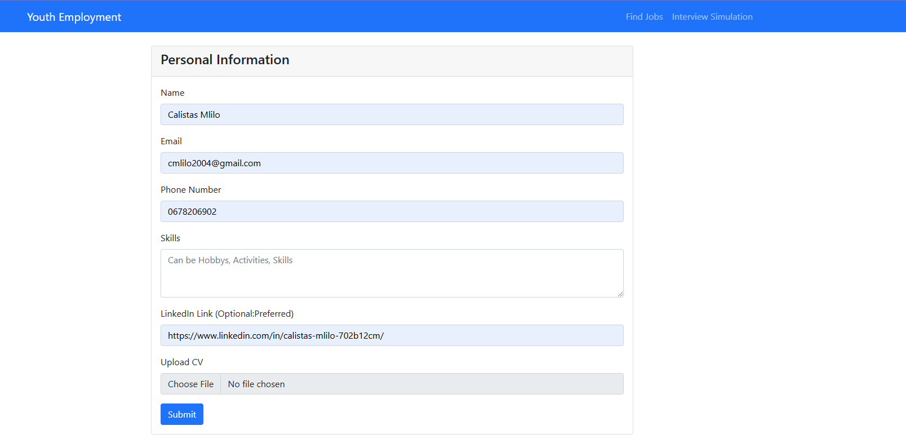
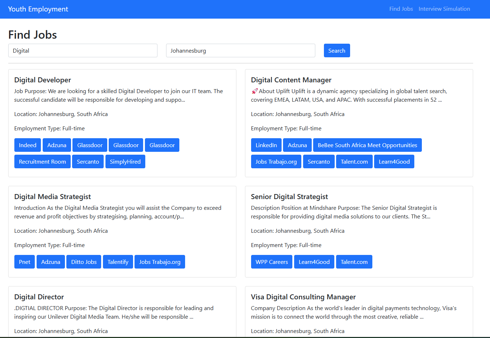
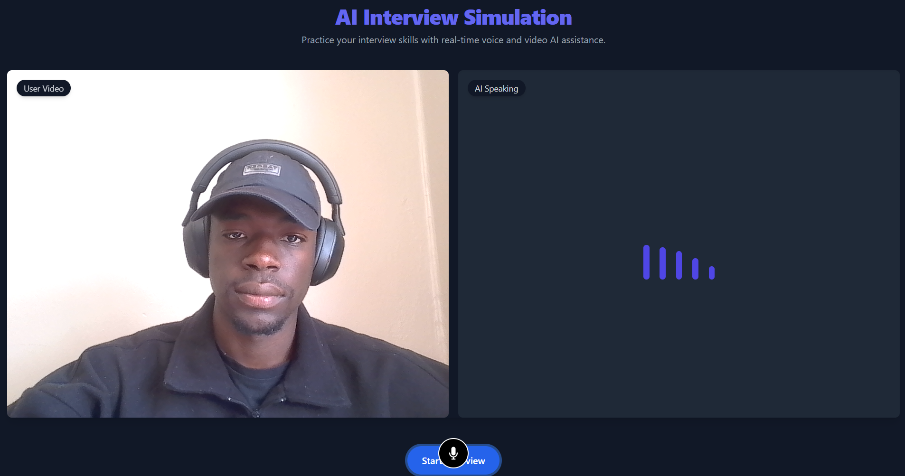

# Melosft Hackathon Project: SmartCareer-Hub 🚀

Welcome to SmartCareer-Hub, your one-stop platform for career development! This Django-based project was crafted with passion during the Melosft Hackathon. Our goal is to empower youth employment through innovative AI-driven features. Whether you're prepping for your next job interview or searching for your dream job, SmartCareer-Hub is here to help!

## Features 🌟
- **Mock Interview Simulation**: Train yourself with AI to ace your real interviews.
- **Job Search Aggregator**: Fetch jobs from over 30 popular job sites, saving you from the hassle of visiting each site.
- **CV Revamp**: (Planned) Get suggestions to polish your resume.
- **Skills Builder**: (Planned) Enhance your skill set with targeted resources.
- **Instant Job Matches**: (Planned) Discover quick task jobs like surveys, remote tasks, and more.

How it looks👀👀




## Getting Started 🛠️

### Prerequisites
Make sure you have Python 3 installed on your system. You can download it from [python.org](https://www.python.org/downloads/).

### Setting Up the Development Environment

1. **Create and activate a virtual environment:**

    - **On Linux/Mac:**
      ```bash
      python3 -m venv myenv
      source myenv/bin/activate
      ```

    - **On Windows:**
      ```bash
      python3 -m venv myenv
      myenv\Scripts\activate
      ```

2. **Install required packages:**
    ```bash
    pip install -r requirements.txt
    ```

### Running the Project

Ensure you are in the project directory where `manage.py` is located, then run:

```bash
python3 manage.py runserver
```

## Project Insights 📖

This project was one of our first to be deployed using Render. The job search feature currently aggregates listings from over 30 different popular job sites, directly linking you to the job posts. The interview simulation is designed to prepare youth for real-life job interviews.

## Team 🤝

- **Calistas**: Team Lead
- **Hloni** : FrontEnd
- **Tshepo** : Fullstack
- **Sakhile** : Fullstack
- **Tshilidzi** : FrontEnd

We had a blast working on this project! As the team lead, I take full responsibility for the exhaustion of any API keys (we used RapidAPI and PlayAI for external APIs). I plan to keep enhancing this project as time allows.

## Note 📝

Due to the usage of external APIs, it's possible that API keys may need to be renewed or updated. Please check and update the keys as necessary.

Try it here:
https://smartcareer-hub.onrender.com/employment/

---

Enjoy using SmartCareer-Hub for your career advancement! 🎉

